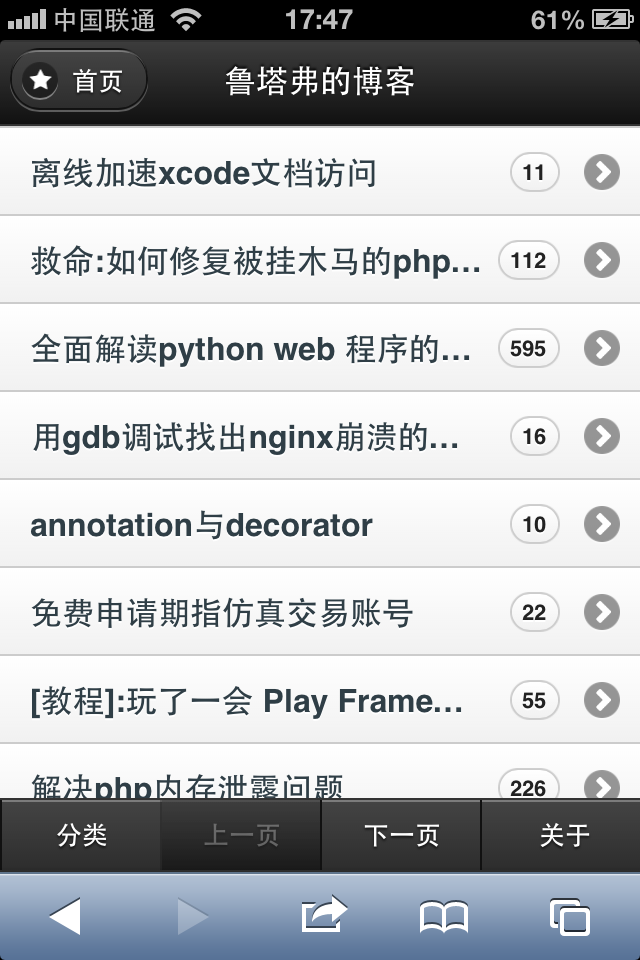

jQuery Mobile site html templates
=======
jQuery Mobile is the easiest way to build sites and apps that are accessible on all popular smartphone, tablet and desktop devices.I use jQuery Mobile to build <http://m.lutaf.com> in very short time

<http://m.lutaf.com>的静态模板文件

##说明

jQuery Mobile简单易学，不需要PS技术支持，不需要太多css/html技术，就可很快完成一个美观大方，搜索引擎友好的的手机网站

##学习方法
- <http://jquerymobile.com/demos/1.2.1/> 这个版本阅读更方便
- <http://jquerymobile.com/demos/1.3.0/>  最新版本文档
- brower：firefox /chrome
- editor: Sublime Text 2
- 不需要任何可视化编辑器，花1小时阅读文档，就能上手

